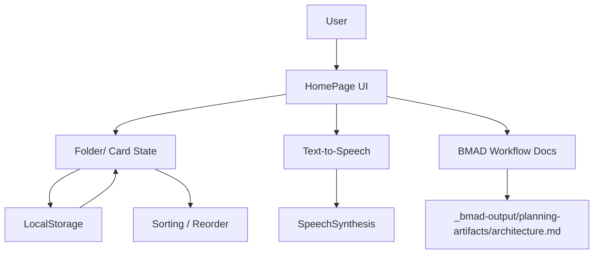

# ztalk

A simple accessible communication app for users with speech disabilities, built with Ionic + Capacitor and engineered with BMAD Method architecture.

## Project Overview

- Mobile-first talk board with cards and folders
- Tap card to speak phrase (Text-to-Speech)
- Create, edit, delete cards and folders
- Drag & drop to reorder cards/folders
- Offline-first local storage

## Key Features

- Card management:
  - Create card with custom text
  - Edit card text inline
  - Delete card
  - Tap to play speech via browser/device TTS

- Folder management:
  - Create, rename, delete folder
  - Assign cards into folders
  - Supports active folder selection for focus

- UI/UX:
  - Large high-contrast controls
  - Simple, low cognitive load
  - Reorder using Ionic re-order controls

- Persistence:
  - LocalStorage-based app state (folders + cards + selected folder)

## Architecture (BMAD)

### Components

- `HomePage` (UI + behavior)
- `LocalStorage` state persistence
- TTS utility (`SpeechSynthesisUtterance` via web APIs)
- `BMAD` document workflow for architecture decision in `_bmad-output/planning-artifacts/architecture.md`

### Mermaid Diagram



## Setup and Run

### Prerequisites

- Node.js 20+
- npm
- Ionic CLI
- (optional) Capacitor for native build

### Install

```bash
cd /mnt/f/windows/LanCache/bmad-test-project/workspace/ztalk
npm install
```

### Development

```bash
npm run start
# or
ionic serve
```

### Android / iOS (optional)

```bash
ionic build
ionic capacitor add android
ionic capacitor add ios
ionic capacitor run android -l --host=0.0.0.0
```

## BMAD Workflow Usage

### Validate BMAD installation

```bash
cd /mnt/f/windows/LanCache/bmad-test-project/workspace/ztalk
npx bmad-method status
```

### Re-run BMAD from workflow

```bash
npx bmad-method install --directory . --modules bmm --yes
```

## Author

`lucaspdroz` via BMAD-assisted implementation
